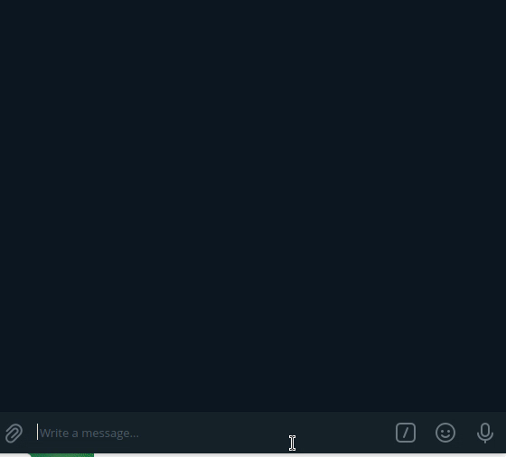

# telegram-node-calendar
A telegram inline calendar in Nodejs..

Built on [telegram-node-bot](https://github.com/Naltox/telegram-node-bot)

I made this because I just needed a calendar interface for a [todo bot](https://github.com/Rotimi-Best/mytodos) I am working on and I was inspired by this exact same [one written in Python](https://github.com/unmonoqueteclea/calendar-telegram).

# Usage
- You need to create a `.env` file and add an BOT_TOKEN=<TOKEN_FROM_BOT_FATHER>
- Then run `npm install` and `npm start`
- Go to telegram and use the /calendar command

# Demo

# Contribution
Feel free to submit issues and help this repository!
